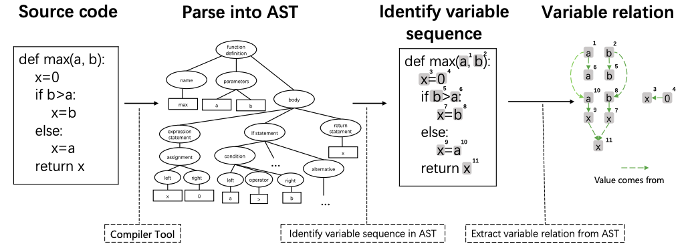

## Semantic-enhanced Code Translation with Transformer-based Models
------------
*Authors: Dung (Judy) Nguyen, Samuel Sasaki* 
Email: {dung.t.nguyen, samuel.sasaki}@vanderbilt.edu

### Overview
Pre-trained models for programming language have achieved dramatic empirical improvements on a variety of code-related tasks such as code search, code completion, code summarization, etc. 
However, existing pre-trained models regard a code snippet as a sequence of tokens, while ignoring the inherent structure of code, which provides crucial code semantics and would enhance the code understanding process.
> *A code snippet contains more than a sequence of tokens!!!*


#### GraphCodeBert
**Key takeaways:**
- GraphCodeBERT is the first pre-trained model
that leverages semantic structure of code to learn code representation.
- Introduce structure-aware pre-training tasks for learning representation from source code and data flow.
- Provides significant improvement on four downstream tasks, i.e. code search, clone detection, code translation, and code refinement.


*The procedure of extracting data flow given a source code. The graph in the rightmost is data flow that represents the relation of `where-the-value-comes-from` between variables.*


*An illustration about GraphCodeBERT pre-training. The model takes source code paired with comment and the corresponding data flow as the input.*

**Our contribution:**
- Study the Transformer-based Models in code understanding task: Code Translation.
- Observation: Using Data Control Flow Graph is efficient but still not enough.
- Conclusion: Incoporating semantic information (Control Flow Graph) can help improve model performance.

### Our Approach
----------
### Model card/dataset card
- Base Model: ESM2 (Facebook Research)
    - Architecture: Transformer-based protein language model
Fine-tuning Dataset: AmyloGraph database
Input: Protein sequences
Output: Classification probabilities for three aggregation categories
Performance Highlights:
Strong performance in identifying faster aggregation cases (F1-score: 0.72)
High precision for no-aggregation cases (0.82)
Balanced performance across multiple metrics
#### Model Card
- Tokenizer:
    - Source: Pretrained from Microsoft
    - Summary: GraphCodeBERT consists of 12 layers, 768 dimensional hidden states, and 12 attention heads. The maximum sequence length for the model is 512. The model is trained on the CodeSearchNet dataset, which includes 2.3M functions with document pairs for six programming languages.
    - Usage: 
    ```
    from transformers import AutoTokenizer, AutoModelForMaskedLM
    tokenizer = AutoTokenizer.from_pretrained("microsoft/graphcodebert-base")
    model = AutoModelForMaskedLM.from_pretrained("microsoft/graphcodebert-base")
    ```
- Build full model:
    ```
    encoder = model_class.from_pretrained(args.model_name_or_path,config=config)    
    decoder_layer = nn.TransformerDecoderLayer(d_model=config.hidden_size, nhead=config.num_attention_heads)
    decoder = nn.TransformerDecoder(decoder_layer, num_layers=6)
    model=Seq2Seq(encoder=encoder,decoder=decoder,config=config,
                    beam_size=args.beam_size,max_length=args.max_target_length,
                    sos_id=tokenizer.cls_token_id,eos_id=tokenizer.sep_token_id)
    ```

#### Dataset Card: Java <-> C#
- The dataset is collected from several public repos:
    - Lucene (http://lucene.apache.org/)
    - POI (http://poi.apache.org/)
    - JGit (https://github.com/eclipse/jgit/)
    - Antlr(https://github.com/antlr/).
- Authors et al. GraphCodeBert collect both the Java and C# versions of the codes and find the parallel functions.
- Source: from original paper (Google)/huggingface
- Data statistic:

    |               | Train  | Valid | Test  |
    |---------------|--------|-------|-------|
    | Number of Samples | 10,300 | 500   | 1,000 |
- Usages:
```
from datasets import load_dataset

ds = load_dataset("google/code_x_glue_cc_code_to_code_trans")
```

----------
### Critical Analysis

----------
### Resource links
- Papers:
- Code:

### Code demonstration

