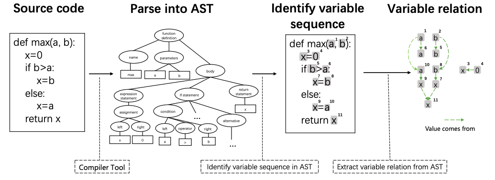
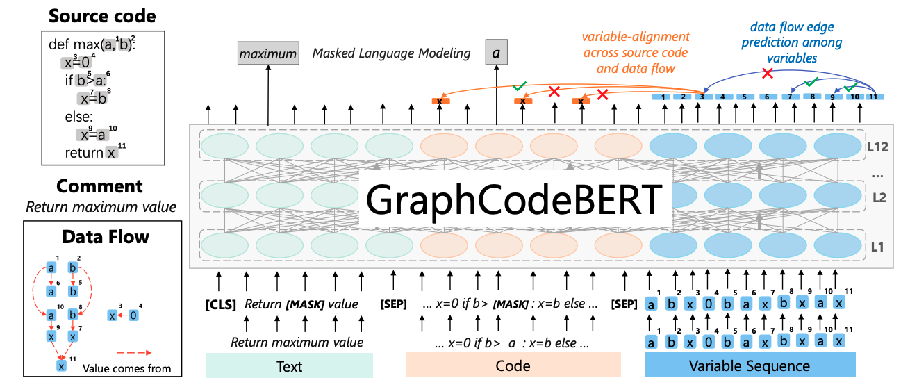
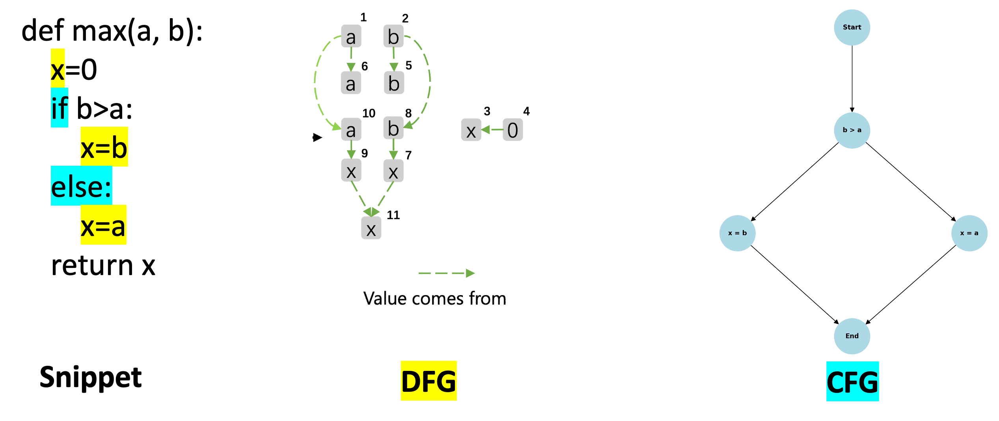

## Semantic-enhanced Code Translation with Transformer-based Models

---

_Authors: Dung (Judy) Nguyen, Samuel Sasaki_

Email: {dung.t.nguyen, samuel.sasaki}@vanderbilt.edu

### Overview

Pre-trained models for programming language have achieved dramatic empirical improvements on a variety of code-related tasks such as code search, code completion, code summarization, etc.
However, existing pre-trained models regard a code snippet as a sequence of tokens, while ignoring the inherent structure of code, which provides crucial code semantics and would enhance the code understanding process.

> _A code snippet contains more than a sequence of tokens!!!_

#### GraphCodeBert

**Key takeaways:**

- GraphCodeBERT is the first pre-trained model
  that leverages semantic structure of code to learn code representation.
- Introduce structure-aware pre-training tasks for learning representation from source code and data flow.
- Provides significant improvement on four downstream tasks, i.e. code search, clone detection, code translation, and code refinement.


_The procedure of extracting data flow given a source code. The graph in the rightmost is data flow that represents the relation of `where-the-value-comes-from` between variables._


_An illustration about GraphCodeBERT pre-training. The model takes source code paired with comment and the corresponding data flow as the input._

**Our contribution:**

- Study the Transformer-based Models in code understanding task: Code Translation.
- Observation: Using Data Control Flow Graph is efficient but still not enough.
- Conclusion: Incoporating semantic information (Control Flow Graph) can help improve model performance.

---

### Our Approach

- Adding information of Control Flow Graph (CFG) to the source tokens
- Adding the attention masks to guide the model to focus on the starting of each control block, i.e., where the `IF` starts, etc.

  _An Example of DFG_
  

- Formal Pseudocode:

  ```
  # Process CFG edges and update source tokens
  For each (source, dest) in CFG:
      If adding 2 tokens exceeds max source length:
          Skip this edge
      Append tokens for source and dest to source_tokens
      Append corresponding position indices to position_idx
      Append unknown token IDs to source_ids
      Update cfg_to_code: mapping from tokens to code

  # Setup attention mask
  For each (a, b) pair in cfg_to_code:
      Enable attention between CFG nodes and their associated code spans:
          attn_mask[node_index + current_index, a:b] = True
          attn_mask[a:b, node_index + current_index] = True

  ```

- Our quantitative results:

  | Method            |   BLEU    | Acc (100%) |
  | ----------------- | :-------: | :--------: |
  | GraphCodeBERT     | **76.68** |  **61.2**  |
  | GraphCodeBERT+CFG | **78.74** |  **62.6**  |

- Examples

  ```Java
  // Source -->
  public static string GetDay(int day) { switch (day) { case 1: return "Monday"; case 2: return "Tuesday"; default: return "Invalid"; } }
  ```

  ```CS
  // Baseline -->
  public static string GetDay(int date){switch (this){case 1:return "Monday";case 2:return "Monday";case 2:return "Monday";}}

  // Ours -->
  public static string GetDay(int day){switch (day){case 1:return "Monday";case 2:return "Sunday";default:return "Invalid";}}'
  ```

---

### Model card/dataset card

#### Model Card

- Tokenizer:
  - Source: Pretrained from Microsoft
  - Summary: GraphCodeBERT consists of 12 layers, 768 dimensional hidden states, and 12 attention heads. The maximum sequence length for the model is 512. The model is trained on the CodeSearchNet dataset, which includes 2.3M functions with document pairs for six programming languages.
  - Usage:
  ```python
  from transformers import AutoTokenizer, AutoModelForMaskedLM
  tokenizer = AutoTokenizer.from_pretrained("microsoft/graphcodebert-base")
  model = AutoModelForMaskedLM.from_pretrained("microsoft/graphcodebert-base")
  ```
- Build full model:
  ```python
  encoder = model_class.from_pretrained(args.model_name_or_path,config=config)
  decoder_layer = nn.TransformerDecoderLayer(d_model=config.hidden_size, nhead=config.num_attention_heads)
  decoder = nn.TransformerDecoder(decoder_layer, num_layers=6)
  model=Seq2Seq(encoder=encoder,decoder=decoder,config=config,
                  beam_size=args.beam_size,max_length=args.max_target_length,
                  sos_id=tokenizer.cls_token_id,eos_id=tokenizer.sep_token_id)
  ```

#### Dataset Card: Java <-> C#

- The dataset is collected from several public repos:
  - Lucene (http://lucene.apache.org/)
  - POI (http://poi.apache.org/)
  - JGit (https://github.com/eclipse/jgit/)
  - Antlr(https://github.com/antlr/).
- Authors et al. GraphCodeBert collect both the Java and C# versions of the codes and find the parallel functions.
- Source: from original paper (Google)/huggingface
- Data statistic:

  |                   | Train  | Valid | Test  |
  | ----------------- | ------ | ----- | ----- |
  | Number of Samples | 10,300 | 500   | 1,000 |

- Usages:

```python
from datasets import load_dataset

ds = load_dataset("google/code_x_glue_cc_code_to_code_trans")
```

---

### Critical Analysis

- What is the impact of this project?
  - Enhanced Understanding of Code Context: Graph CodeBERT can reason about the logical and functional dependencies in code.
  - Improved Accuracy in Downstream Tasks: code translation.
  - Incorporating these structures can help Graph CodeBERT generalize its understanding across different programming languages.
- What is the next step?
  - Use benchmarks like CodeXGLUE to evaluate task performance (e.g., code summarization, bug detection, translation).
  - Different model architectures: CodeBert, CodeT5, etc.
  - Using semantic knowledges to develop evaluation metrics, and verification of the generated outputs.

---

### Resource links

- Papers:
  - [GRAPHCODEBERT: PRE-TRAINING CODE REPRESENTATIONS WITH DATA FLOW](https://openreview.net/pdf?id=jLoC4ez43PZ)
  - [CodeXGLUE: A Machine Learning Benchmark Dataset for Code Understanding and Generation](https://arxiv.org/pdf/2102.04664)
  - [StructCoder: Structure-Aware Transformer for Code Generation](StructCoder: Structure-Aware Transformer for Code Generation)
- Code:
  - [CodeXGLUE](https://github.com/microsoft/CodeXGLUE)
  - [CodeBERT](https://github.com/microsoft/CodeBERT)

---

### Code demonstration

Our code demonstration with an interactive notebook is at

[translation/code_demo_evalutate_model.ipynb](translation/code_demo_evalutate_model.ipynb)

---

### Interactive Demo

To run the interactive demo, please ensure that all dependencies are installed and start the demo by running the following commands from the root of the repository.

```bash
# start a virtual environment
python3 -m venv venv
source venv/bin/activate # if on macOS
pip install streamlit
pip install streamlit_code_editor
pip install requests
pip install torch
pip install transformers
streamlit run Overview.py
```
